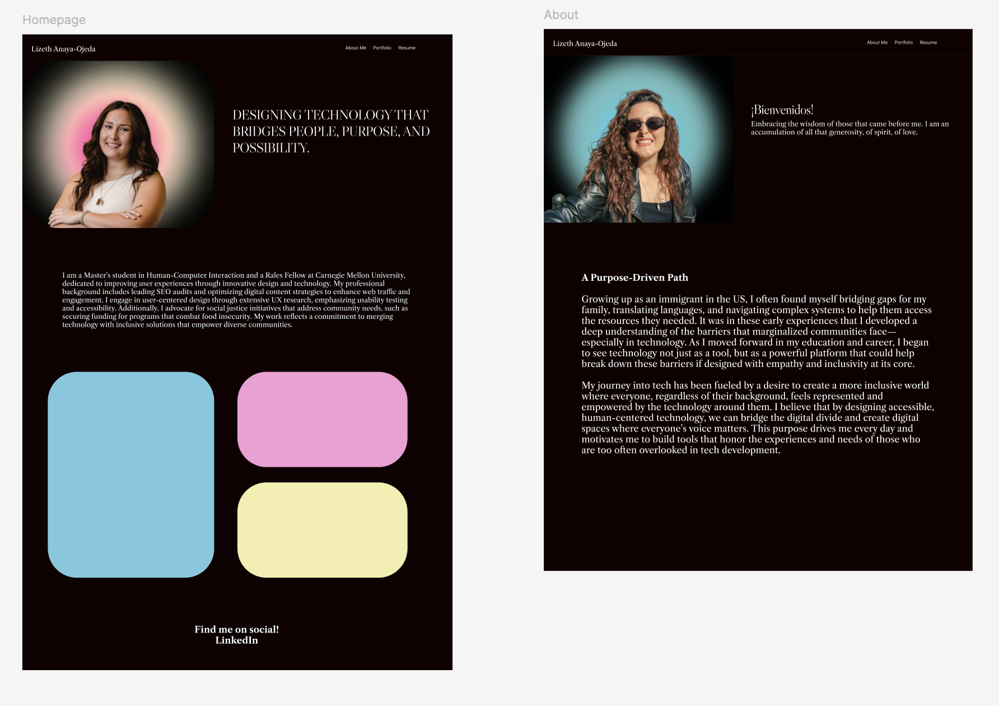
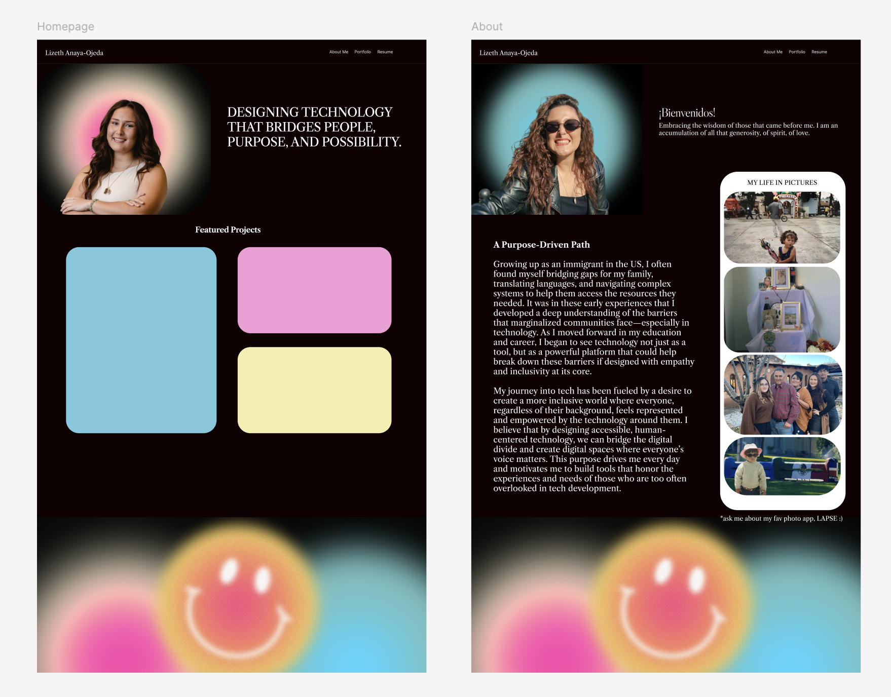
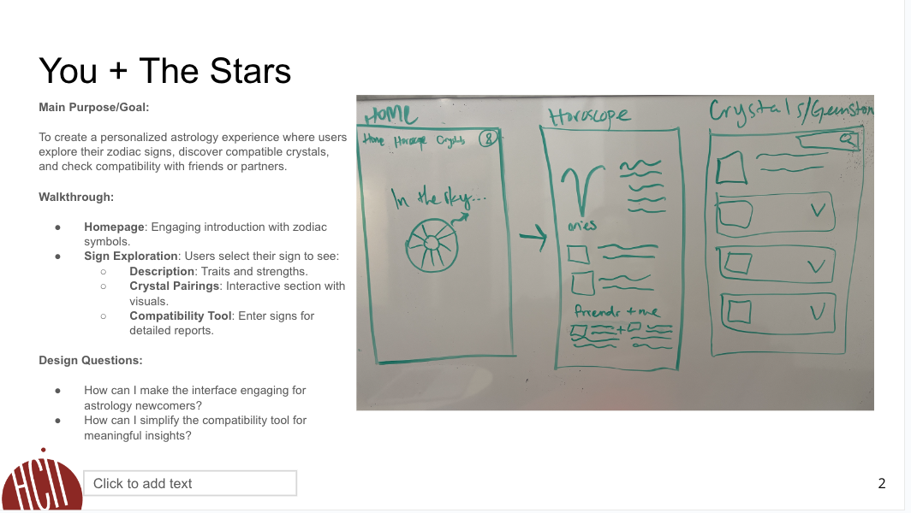
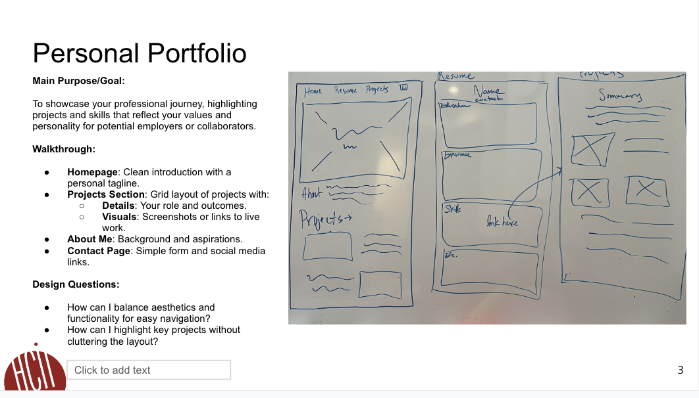
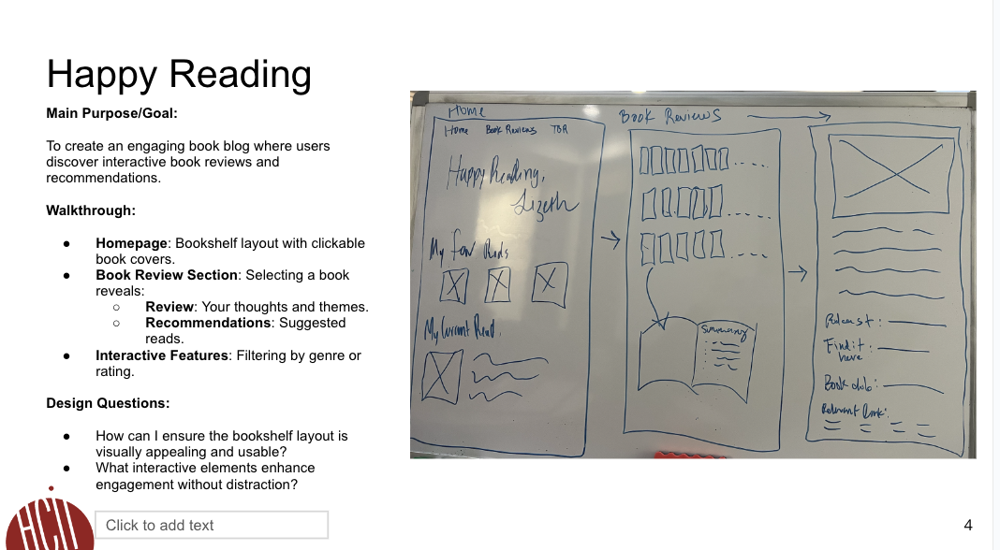

# **FP4 \- Final Project Writeup**

Feel free to refer to this [Markdown Cheat Sheet](https://www.markdownguide.org/cheat-sheet/) to make your writeup more organized, and you can preview your markdown file in VSCode [Markdown editing with Visual Studio Code](https://code.visualstudio.com/docs/languages/markdown#_markdown-preview). 

## Part 1: Website Description

Describe your website (300 words).

The main goal of my website is to showcase my professional journey in a way that feels authentic, thoughtful, and personal. It’s more than just a portfolio—it’s a space where potential employers, collaborators, and industry peers can get a feel for my approach to UX design, accessibility, and responsible AI. I want people to walk away with a clear sense of who I am as a designer, problem-solver, and human.

The site is built with UX recruiters, hiring managers, and potential collaborators in mind. It’s for anyone looking for someone with a creative approach to design and a strong technical foundation. I also see it as a way for others who share my values—like advocating for accessible design and ethical AI—to connect with me.

As for what the site communicates, it highlights my story, my skills, and my work. Visitors can browse case studies that walk through my projects step-by-step, and see who I am as a person as well as my design approach and philosophy in the "About Me" section. I want the experience to feel clear, human, and inviting. The design reflects that, with a clean layout, clear calls to action, images of my life "Mi Vida en Fotos" and intuitive navigation.

To keep visitors engaged, I’ve added some interactive elements. Users can switch between light and dark mode to customize the experience to their liking. There’s a dynamic moving gallery that offers a playful, immersive way to see my life in pictures where I share special moments. Plus, the "About Me" section has clickable tabs, so users can dive deeper into different parts of my story. All of these features are designed to keep people exploring, clicking, and connecting with my work in a way that’s memorable and fun.

## Part 2: User Interaction

* 1. Light/Dark Mode Toggle

How it works: There’s a toggle button in the header represented by a sun or moon emoji that lets users switch between light and dark mode. When they click it, the background, text, and images adjust instantly, creating a personalized experience. It also ensures strong color contrast and accessibility for users with different visual preferences.

* 2. Project Card Clicks

How it works: On the homepage or projects page, users can click on individual project cards to learn more. Clicking takes them to a dedicated page that breaks down the project’s context, process, and results. It’s a chance to show off the depth of my work in a clear, visual way.

* 3. About Me Tabs

How it works: Inside the "About Me" section, users can click on tabs that reveal different parts of my story, like "My "Why"," "Future Aspirations," or "Values." Instead of refreshing the whole page, the content updates right there, making it feel smooth and interactive.

* 4. Dynamic Gallery

How it works: Users can scroll to the bottom of my about page to view a dynamic gallery of special moments in my life. 

## Part 3: External Tool

* 1. GSAP (GreenSock Animation Platform)

Why did you choose to use it over other alternatives?
I chose GSAP because it offers smooth, high-performance animations with more control and flexibility than CSS animations or other libraries. Its timeline functionality allows for easy sequencing, and the ability to stagger animations adds a polished, professional touch.

How you used it?
I used GSAP to create an animated text effect for the header on my homepage. By targeting .animated-text span, I built a timeline animation where each letter rises into view (y: 0), fades in (opacity: 1), and follows a staggered delay of 0.2 seconds, creating a smooth, cascading text reveal.

What does it add to your website?
The GSAP text animation makes the homepage more dynamic and engaging, drawing users' attention as soon as they land on the site. It adds a sense of motion and creativity.

* 2. Google Fonts API

Why did you choose to use it over other alternatives?
I chose the Google Fonts API because it’s fast, free, and easy to implement. It also ensures web-safe, cross-browser-compatible typography, making the site accessible to all users.

How you used it?
I imported two fonts—Fredoka One and Nunito Sans—using a link to the Google Fonts API in the <head> of my HTML file. Fredoka One is used for headings to give them a bold, playful feel, while Nunito Sans is used for body text to maintain easy readability and visual balance. These font choices ensure a clear typographic hierarchy and consistent brand style throughout the site.

What does it add to your website?
The combination of Fredoka One and Nunito Sans gives the website a playful but professional vibe, perfectly matching the overall design aesthetic. Fredoka One makes the headings bold, fun, and attention-grabbing, while Nunito Sans keeps the body text clean, modern, and easy to read. Together, they enhance both the personality and usability of the site, creating a unique and accessible user experience.

## Part 4: Design Iteration

Throughout the development of my website, I made several key design iterations to enhance both functionality and user experience. Initially, I planned to use parallax scrolling for visual appeal, but after receiving feedback from my TA, I realized it could be distracting and unnecessary. Instead, I pivoted to adding a light and dark mode toggle, as it better complemented the color contrast in my images and introduced a layer of interactivity. I also refined the homepage header animation, using GSAP to create a dynamic text reveal that provides a more engaging first impression. Another significant change was switching the heading font from Big Caslon to Fredoka One. I felt that Fredoka One better aligned with the playful, modern vibe of the site's design while still maintaining a clean look. These changes were driven by a desire to balance aesthetics with usability, ensuring my site feels modern, interactive, and easy to navigate.

## Part 5: Implementation Challenge

The biggest challenges I faced in implementing my website were working with GSAP for the first time, which required some time to learn and get the animations just right. Implementing the light and dark mode functionality was a significant lift and took a long time to debug and perfect. The dynamic gallery, which I built using CSS, also added complexity to the layout and functionality. Additionally, I didn't fully account for how much styling my portfolio would require, leading to more design adjustments than I initially anticipated.

## Part 6: Generative AI Use and Reflection

For my final project, I made extensive use of Perplexity, an AI tool that helped me implement key features like the light vs dark mode toggle and the animated text on my homepage header. These tools not only made the development process smoother but also added unique and interactive features that enhanced the user experience of my portfolio website.

* Using Perplexity for Light vs Dark Mode
One of the most important features I wanted to implement on my website was a light and dark mode toggle, and I used Perplexity AI to help with this process. I wanted the toggle to be global, meaning it could be easily transferred across different files of the website, and I wanted it to include custom features, such as a sun and moon emoji for visual cues. Perplexity guided me through the process of adapting both my CSS and HTML, suggesting best practices for achieving this functionality. The tool helped me integrate JavaScript for toggling between light and dark themes and provided clear examples of how to store the user’s preference in local storage so that the setting persists across page reloads. This was great because it saved me time in troubleshooting and made the feature work seamlessly across all pages.

* Using Perplexity for GSAP Animated Text
Another key feature I wanted for my portfolio was an engaging header animation, and Perplexity was again a helpful resource. I asked the AI to assist me in implementing an animated text effect for my homepage header, specifically using GSAP (GreenSock Animation Platform). Perplexity not only provided code suggestions for the GSAP timeline but also helped clarify how to use GSAP’s powerful animation tools, which I was unfamiliar with. The AI offered a step-by-step breakdown of how to animate each block in my header text, making them fade in and move smoothly into place using GSAP’s staggered animation feature. 

* AI in Code Optimization and Troubleshooting
In addition to helping me implement specific features, Perplexity was a crucial tool in resolving issues during development. For example, I ran into some problems with styling my CSS, particularly when working with responsive design and layout adjustments for different screen sizes. Perplexity helped me debug these issues by providing insights into how to structure the CSS and suggested more efficient ways of achieving the desired layout. This assistance made the website much more responsive and ensured that it looked great across all devices.

### Usage Experiences by Project Aspects

Feel free to edit the column \_ (other?) or add more columns if there's any other aspect in your project you've used the GenAI tools for.

For the following aspects of your project, edit the corresponding table cell to answer:
- *Usage*: Whether you used / did not use this tool for the aspect. Enter [Yes/No]
- *Productivity*: Give a rating on whether this tool makes your productivity for X aspect [1-Much Reduced, 2-Reduced, 3-Slightly Reduced, 4-Not Reduced nor Improved, 5-Slightly Improved, 6-Improved, 7-Much Improved].

| Tool Name | Ratings | design | plan | write code | debug | resource finding |
| :---- | :---- | :---- | :---- | :---- | :---- | :---- |
| Perplexity AI | Usage | Yes | Yes | Yes | Yes | Yes | Yes |
| Perplexity AI | Productivity | 3 | 7 | 5 | 6 | 7 |

### Usage Reflection

> Impact on your design and plan 
* It matched my expectations and plan in [FP2](#generative-ai-use-plan) in that … For example, 
1. Perplexity AI — It matched my expectations by helping me create a global light and dark mode toggle. I wanted this feature to be reusable across multiple pages, and Perplexity's instructions gave me a clear structure to get me started.
2. Perplexity (for GSAP guidance) — It met my expectations by providing step-by-step instructions on how to create an animated text header using a GSAP timeline. My goal was to introduce dynamic motion on the page, and the use of GSAP’s staggered animations fit perfectly with my initial vision.

* It did not match my expectations and plan in [FP2](#generative-ai-use-plan) in that … For example, 
1.  Perplexity — While Perplexity's support helped with the logic for the global toggle, it did not offer guidance on how to apply this toggle across multiple pages. I had to figure out how to transfer the functionality to other pages on my own as well as how to adjust the javascript code for these changes. A lot of manual debugging and using the console.
2.  Perplexity (for GSAP guidance) — Perplexity provided guidance on basic staggered animations, but its suggestions for timing and easing were too fast and abrupt for my site's aesthetic. I had to make manual adjustments to fine-tune the flow and pacing of the animations.

* GenAI tool did/did not influence my final design and implementation plan because … For example,
1. Perplexity — Perplexity influenced the way I structured the global light/dark mode toggle. While the idea of using a toggle button with emoji icons (sun and moon) was my own, the guidance on how to structure the JavaScript logic for toggling styles globally made the process smoother.
2. Perplexity (for GSAP guidance) — Perplexity influenced my final design for text animations. Initially, I planned to animate large text blocks at once, but Perplexity's suggestion to use staggered animations changed my approach. This decision gave the header a more polished and playful look.

> Use patterns
* I accepted the generations when …  For example, 
1. Perplexity — I accepted Perplexity's logic for a global toggle system. It provided clear instructions for toggling classes via JavaScript, which I reused across multiple pages. This saved me time and gave me a more modular approach. I also really appreciated the detailed explanations for blocks or aspects of code I was unsure of.
   
* I critiqued/evaluated the generated suggestions by … For example, 
1. Perplexity (for GSAP guidance) — Perplexity's stagger animation guidance was useful, but its suggestions for the timing and easing didn’t match my vision for smooth, playful transitions. I critiqued the abruptness of the animations and adjusted the stagger delay and easing curve for a more polished look.

> Pros and cons of using GenAI tools
* Pros
1. Focus on structure first — Using Perplexity allowed me to focus on building the “skeleton” of my site before diving into more complex interactive features. This approach kept my project moving forward while giving me the flexibility to learn and experiment with new concepts like GSAP animations and the light/dark mode toggle. It felt like having a guide that I could revisit whenever I was ready to tackle the next challenge.
2. Support for interactivity — When I was ready to add interactive features like the text animations and light/dark toggle, Perplexity provided clear implementation ideas. I could move at my own pace, which allowed room for error and exploration. This process helped me better understand the tools I was using, rather than just copying code without context.
   
* Cons
1. Lack of explanations — One drawback was that Perplexity sometimes provided code without offering much explanation. I had to ask follow-up questions to understand why certain approaches were being used. This slowed me down at times, especially when working with GSAP timelines, since I wanted to understand the logic behind it.
2. Limited context awareness — Perplexity occasionally suggested methods that didn’t fully match my project's scope. For example, I was advised to use CSS-only solutions for the light/dark toggle, but I needed something more global to persist user preferences. This required extra research to find a way to store the user's toggle choice using local storage.

### Usage Log

Document the usage logs (prompts and chat history links) for the GenAI tools you used. Some tools may not have an easy way to share usage logs, just try your best! Some instructions for different tools:

1. [Perplexity AI](https://www.perplexity.ai/search/i-would-like-to-implement-a-li-h1BPeId3RU.rUY7jvSyy1g)

# **FP3 \- Final Project Check-in**

## Implementation Plan Updates

- After getting feedback from my TA, I’ve decided to move away from using parallax scrolling on my portfolio. At first, I thought it would add a cool, interactive element, but after some reflection, I realized it might be a bit too flashy for the style I’m going for. Instead, I’m shifting my focus to adding a light and dark mode toggle. I think this change will make my portfolio feel more modern and user-friendly. Plus, the contrast between the colors in my images and the light/dark backgrounds will create a more visually striking experience. I’m excited about this direction because it also gives me a chance to showcase my skills in responsive design and accessibility, which I know are important for UX roles. I’ll be looking into how to make sure the text stays legible and the contrast meets accessibility standards so that the toggle isn't just a "nice-to-have" feature but a thoughtful, user-centered addition.

## Generative AI Use Plan Updates

- To bring these updates to life, I’m planning to use Perplexity AI as a research tool. I’ll rely on it to figure out the technical details of implementing the light/dark mode toggle—like how to manage state changes and ensure accessibility. I also want to add animated text to my website header using GSAP (GreenSock Animation Platform). Since I’m new to GSAP, Perplexity will be my go-to for learning how to get it up and running. I’m hoping it can guide me through the process with code examples and troubleshooting tips. This approach feels like a great way to learn on the fly while still pushing my project forward. I’m excited to see how it all comes together and to document this process as part of my portfolio story—showing not just what I built but how I approached learning something new along the way.

Remember to keep track of your prompts and usage for [FP4 writeup](#part-6-generative-ai-use-and-reflection).

---

# **FP2 \- Evaluation of the Final project**

## Personal Portfolio
This project aims to create a personal portfolio website that effectively showcases my professional journey, emphasizing key projects and skills that align with my values and personality to attract potential employers and collaborators. The design will feature a clean homepage introduction, a grid layout for project highlights with detailed roles and outcomes, an engaging "About Me" section, and a straightforward contact page, all while balancing aesthetics and functionality for seamless navigation.

## High-Fi Prototypes

### *Prototype 1 and 2 (Home and About)*

## Usability Test

For my usability study, I had my evaluators examine and evaluate my personal portfolio by testing my two high-fidelity prototypes. They read through my homepage and navigated to the "About Me" page, providing feedback on the information architecture and layout of information. I also gathered insights on the design aspects, such as colors and overall aesthetics.

The feedback from my evaluators indicated that the website lacked personality and that the footer appeared too plain. They suggested including fun facts about my personal life on the "About Me" page. Additionally, they found the block of text following the hero image and statement overwhelming, recommending that I use that space to capture user attention with images instead.

In response to the feedback, I added a footer that aligns with the overall color scheme and incorporates a smiley face to enhance personality. I also redesigned the "About Me" page to include two columns, adding images on the right side to provide insight into who I am. Furthermore, I reorganized the homepage by removing the dense paragraph to create a more inviting and engaging experience for visitors.

## Updated Designs

## Feedback Summary

Both Hedy and Hannah appreciate the personality conveyed through my use of photos, smiley faces, and a bright color scheme, which they feel effectively showcase who I am. Hedy suggests enhancing the About page with a carousel feature for the photos, scattering smaller smiley faces throughout the page instead of a large one at the bottom, and possibly adding a gradient background for visual appeal. Hannah values the inclusion of feedback from people who know me and those who don’t, noting that the aura photo and colors capture my personality well. She suggests reducing the size or prominence of the smiley faces at the bottom to keep the focus on my projects, breaking up the About page with more visuals, increased white space, and condensed text, and choosing a more readable typeface for the homepage.

In response to this feedback, I have decided to implement several updates to my portfolio. I plan to include an image gallery to create a more dynamic and organized display of photos, particularly on the About page. Additionally, I will implement parallax scrolling to add visual interest and depth, enhancing the browsing experience while keeping the focus on key content. I will also adjust the footer to make it less prominent, ensuring it doesn’t detract from the project showcase and other primary elements. These updates will help maintain the personal touches that convey my personality while creating a more streamlined and engaging layout.

**Feedback Notes**

---

**Hedy:**
- Loves the photos, smiley faces, and bright colors; these elements show my personality well.
- Suggestion: Add a carousel feature for the photos on the About page.
- Suggestion: Scatter small smiley faces across the page instead of one large smiley face at the bottom.
- Suggestion: Consider using a gradient background for added visual interest.

**Hannah:**
- Appreciates that I included feedback from both familiar and unfamiliar perspectives.
- Thinks my personality is conveyed well through the aura photo and color scheme.
- Suggestion: The smiley faces at the bottom of the page may be distracting from the project content; consider toning them down or reducing their size.
- Suggestion: Break up the About page with more visuals, increased white space, and condensed text for better flow.
- Suggestion: Use a different, more readable typeface on the homepage.

## Milestones

Outline weekly milestones to plan your expected implementation progress until the end of the semester (\~300 words). 

### *Implementation Plan*

- [ ] Week 9 Oct 28 \- Nov 1:
  - [X] FP1 due
  
- [ ] Week 10 Nov 4 \- Nov 8:   
  - [ ] FP2 due

- [ ] Week 11 Nov 11 \- Nov 15:
	- [ ] Focus on the homepage layout and implement animations, specifically integrating parallax scrolling. This will involve designing the visual flow and ensuring that the scrolling effect enhances user engagement without overwhelming the content.
- [ ] Week 12 Nov 18 \- Nov 22:
	- [ ] Develop the About page layout, incorporating an image gallery and corresponding animations. The goal is to create an organized and visually appealing space that showcases my personality while ensuring the gallery is easy to navigate.
- [ ] Week 13 Nov 25 \- Nov 29:
	- [ ] Work on the project page layout, implementing animations that utilize image iframes or pop-ups for a more interactive experience. This week will be crucial for ensuring that visitors can easily access project details without feeling cluttered.

  - [ ] Thanksgiving  
- [ ] Week 14 Dec 2 \- Dec 6:
	- [ ]  Conduct user testing to gather feedback on the website's usability and design elements. This feedback will inform design iterations, ensuring that the final product meets user needs and expectations.
  - [ ] FP4 due
 	 - [ ] incorporate any adjustments based on user testing insights and finalizing the portfolio for submission.

### *Libraries and Other Components*

List the JS libraries and other components (if applicable) that you plan to use. 
* 

Parallax scrolling resources: 
Reading:
https://www.w3schools.com/howto/howto_css_parallax.asp 
https://www.geeksforgeeks.org/parallax-scrolling-effect-using-css/
JS Libraries:
- fullPage
- Anime.js
- React JS
- Lightgallery.js
- PhotoSwipe
  

## Generative AI Use Plan

With only a few weeks to develop my personal portfolio, I plan to use Generative AI to accelerate my learning and implementation of parallax scrolling and interactive libraries, including fullPage, Anime.js, React JS, Lightgallery.js, and PhotoSwipe. Generative AI will serve as an efficient learning assistant, enabling me to absorb key technical concepts quickly and effectively.

By leveraging Generative AI, I can streamline the process of understanding these libraries and their functionalities. For example, I’ll use AI to pull concise, actionable insights from lengthy documentation and complex tutorials, allowing me to grasp each library’s specific properties, methods, and use cases in a fraction of the usual time. This will give me the foundational knowledge needed to implement dynamic parallax scrolling effects and animations that match my design vision.

Generative AI can also assist with troubleshooting by diagnosing errors and suggesting debugging steps for issues related to library integration or parallax functionality. This support will help me quickly resolve issues, ensuring my focus remains on creating a visually engaging, interactive experience. AI’s optimization tips can also refine my code’s efficiency and responsiveness, which is essential given the animated, image-heavy nature of parallax designs.

### *Tool Use*

 What would you use? Edit the list given your plan. For each tool, explain briefly on what do you expect Generative AI to help you with and what might it not be able to help you with.

* ChatGPT  
	* I will use it for quickly understanding documentation and exploring library functionalities because it can help me break down complex concepts into manageable explanations and provide tailored examples. This will allow me to learn the essential properties and methods of each library, such as fullPage and Anime.js, more efficiently.
	* I will not use it to produce code that I don’t fully understand, as my goal is to supplement what I have already learned in my homework assignments. I want to ensure I grasp the logic behind every component rather than relying on AI to generate unfamiliar code.

 
* GitHub Copilot
	* I will use it for generating initial setups and suggesting code patterns because it can help by providing base code structures for common tasks, like setting up parallax backgrounds or adding animations. This will streamline repetitive tasks and speed up code experimentation.
	* I will not use it for larger projects, as I don’t find it reliable for maintaining code consistency at scale. Copilot tends to lose track of naming conventions and can generate code that doesn’t fully align with my specific project requirements, which can make debugging more difficult. 

* Stack Overflow
	* I will use these resources for troubleshooting specific code issues and verifying AI-generated code snippets because they provide community-verified solutions and official guidance, helping to ensure the reliability and functionality of my code.
	* I will not rely on them for time-efficient explanations since sifting through multiple posts and documentation pages can be slower than directly querying AI for concise answers.

### *Responsible Use*

To use Generative AI responsibly, I would treat it as a learning and support tool rather than a substitute for my own understanding. My goal is to deepen my skills by supplementing what I’ve already learned in homework assignments, not to rely on AI-generated code I don’t fully understand. This means I will use Generative AI primarily for breaking down complex documentation, exploring new library functions, and gaining insights into how specific tools work—allowing me to understand the underlying logic and apply it thoughtfully.

For coding, I plan to use AI tools like GitHub Copilot selectively for initial setups and simple patterns, but I will take responsibility for checking and modifying any generated code to ensure consistency and alignment with my project requirements. I recognize that Copilot can lose track of naming conventions and produce inconsistent code in larger projects, so I won’t rely on it for more complex implementations. By using AI in this measured way, I can enhance my development process while maintaining control and responsibility over the final output, ensuring it reflects my own learning and understanding.

# FP1 - Proposal for Critique

## Idea Sketches

* Idea 1

This astrology platform features an interactive night sky with clickable constellations for each zodiac sign. Users can immerse themselves in their sign’s constellation to explore personalized traits, compatible crystals, and a tool for checking sign compatibility with friends or partners. The design will be accessible with high contrast, alt text, and keyboard navigation, with thorough research ensuring accurate, engaging insights across all twelve signs.

* Idea 2 

This portfolio site highlights your professional journey, values, and skills for potential employers or collaborators. The homepage offers a clean introduction with a personal tagline, followed by a projects section in a grid layout showcasing your role, outcomes, and visuals. An "About Me" page shares your background and aspirations, while a contact page provides a simple form and social media links. The design will balance aesthetics and functionality for easy navigation, emphasizing key projects in a clear, uncluttered layout.

* Idea 3 

This book blog invites users to explore interactive reviews and recommendations in a visually engaging bookshelf layout with clickable book covers. Selecting a book opens a review section with your insights, key themes, and tailored recommendations, while interactive features allow filtering by genre or rating. The design will focus on a clean, accessible bookshelf display and subtle interactive elements to enhance engagement without distracting from content.

## Feedback Summary

* You and The Stars
	- Allison: Is the homepage meant to show only your constellation, or should it display everyone’s? It could feel more personal if it defaults to your constellation but still allows you to see others.
    	- Suggestion: In a portfolio context, consider balancing image size to avoid excessive scrolling. A zoom-in option could add more detail without overwhelming the viewer.

	- Megan: Enjoys the addition of crystals and compatibility features.
	    - Clarified: This will be a web-based application.

	- Anna: Likes the crystals feature and wonders if compatibility data can be saved.
	    - Suggestion: A way to store compatibility information would be useful.

* Personal Porfolio
    
    - Allison: How large are the images going to be?
    	- Suggestion: In a portfolio context, consider balancing image size to avoid excessive scrolling. A zoom-in option could add more detail without overwhelming the viewer.

	- Megan: Focus on showcasing 3-4 key projects on the homepage, with additional projects listed below under a header labeled “Other Projects.”

	- Anna: Keep the navigation bar at the top and make it "sticky" for easy access.
	    - Suggestion: Include a “Back to Top” button to quickly navigate to the top of the page.

*  Happy Reading
    - Allison: Emphasize accessibility, especially for an interactive bookcase feature. The concept is strong otherwise.

	- Megan: Mentions that GoodReads can be difficult to track, so this alternative is promising.
	    - Suggestion: Think about how the profile and login process might work, especially if this is intended for a community.

	- Anna:  Likes the idea and suggests placing “current read” above “favorites” on the homepage to emphasize a personal, blog-like feel.

## Feedback Digestion

Based on the feedback received, here are the specific critiques I’ll incorporate into my next design iteration and my reasoning behind each decision:

* Image Sizing and Zoom-In Option (Allison)

- Incorporate: I’ll implement a balanced image size with a zoom-in option for recruiters to view details without needing to scroll excessively. This aligns with the goal of creating an easy-to-navigate portfolio while allowing in-depth views of key projects.

* Highlighting Key Projects on the Homepage (Megan)

- Incorporate: Featuring 3-4 key projects prominently on the homepage is a great way to catch recruiters’ attention quickly. I’ll add a “Other Projects” section below to house additional work, streamlining the homepage layout and focusing on the most impactful projects.
Sticky Navigation and “Back to Top” Button (Anna)

* Incorporate: Keeping navigation fixed at the top will make it easier for users to explore the site, and the “Back to Top” button ensures a smoother user experience on longer pages. This feedback aligns well with creating a user-friendly design.
Image Sizing Constraints (Allison)

- Dismiss: I’ll take a balanced approach to image sizing but avoid too small of an image constraint, as visuals are essential in showcasing project details. I want images to feel accessible without overwhelming the user, so I’ll strike a balance with slightly larger images paired with the zoom feature.
These adjustments reflect my goal to create a portfolio that is visually engaging, easily navigable, and highlights key projects without overwhelming viewers. Each incorporated element enhances the portfolio’s usability and appeal for recruiters while respecting design constraints.
