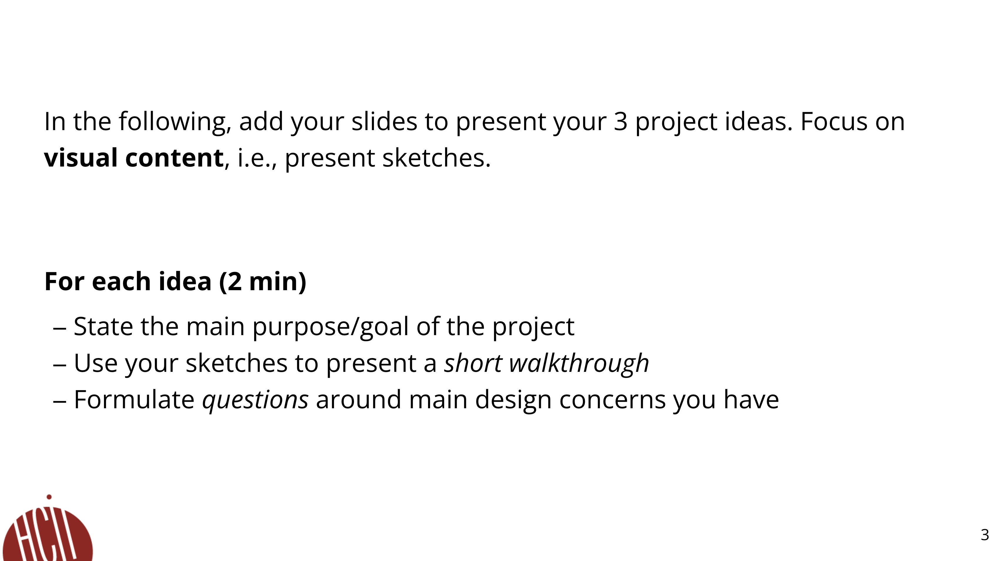

<mark>**Note that this document order from FP4 -> FP1**</mark>

# **FP4 \- Final Project Writeup**

Feel free to refer to this [Markdown Cheat Sheet](https://www.markdownguide.org/cheat-sheet/) to make your writeup more organized, and you can preview your markdown file in VSCode [Markdown editing with Visual Studio Code](https://code.visualstudio.com/docs/languages/markdown#_markdown-preview). 

Please sign up for the study at [https://tinyurl.com/pui-study](https://tinyurl.com/pui-study) to allow us to use your submission to create a better GenAI assistant for designers!

## Part 1: Website Description

Describe your website (300 words).

* What is the purpose of your website?   
* Who is the target audience?  
* What information do you convey with your website?   
* How is it interesting and engaging? 

## Part 2: User Interaction

How a user would interact with your website? For each step, briefly but clearly state the interaction type & how we should reproduce it.

1. Interaction type. Click on X on page Y / scroll on page X, etc.  
2. 

## Part 3: External Tool

Describe what important external tool you used (JavaScript library, Web API, animations, or other). Following the bulleted list format below, reply to each of the prompts.

1. Name of tool1  
   * Why did you choose to use it over other alternatives? (2 sentences max)  
   * How you used it? (2 sentences max)  
   * What does it add to your website? (2 sentences max)  
2. Name of tool2

## Part 4: Design Iteration

Describe how you iterated on your prototypes, if at all, including any changes you made to your original design while you were implementing your website and the rationale for the changes. (4-8 sentences max)

## Part 5: Implementation Challenge

What challenges did you experience in implementing your website? (2-4 sentences max)

## Part 6: Generative AI Use and Reflection

Describe how you used Generative AI tools to create this final project (a page max, \~500 words).

### ChatGPT Usage
* It matched my expectations and plan in [FP2](#generative-ai-use-plan) in that …  
* It did not match my expectations and plan in [FP2](#generative-ai-use-plan) in that …  
* I critiqued/evaluated the generated suggestions before incorporation by … For example, this tool once suggested … but I modified/rejected the suggestion because …  
* I accepted the generations when … This tool did/did not influence my final design and implementation plan because … For example, this tool once suggested … and I adjusted my design according to the suggestion because … 
* The pros and cons of using this Generative AI tool: …

***Usage Experiences by Project Aspects***

| Ratings | design | plan | write code | debug | \_ (other?) |
| :---- | :---- | :---- | :---- | :---- | :---- |
| Usage1 | \[yes/no\] because … | \[yes/no\] because … | \[yes/no\] because … | \[yes/no\] because … | \[yes/no\] because … |
| Reduce/Improve Productivity2 | \[rating\] because … | \[rating\] because … | \[rating\] because … | \[rating\] because … | \[rating\] because … |

[1] I used / did not use this tool for X aspect of the project because …  
[2] This tool makes my productivity for X aspect (1-Much Reduced, 2-Reduced, 3-Slightly Reduced, 4-Not Reduced nor Improved, 5-Slightly Improved, 6-Improved, 7-Much Improved)

***Prompts and Chat History Links***

Attach all the prompts you’ve used (e.g., for ChatGPT you can anonymously [share](https://help.openai.com/en/articles/7925741-chatgpt-shared-links-faq) your chat history).

### Add more subsections for the GenAI tools you've used, e.g., Copilot, etc.

Copy all the content under the [ChatGPT Usage](#chatgpt-usage) section to answer the same questions for this tool.

---

# **FP3 \- Final Project Check-in**

Document the changes and progress of your project. How have you followed or changed your implementation & GenAI use plan and why? Remember to commit your code to save your progress.

## Implementation Plan Updates

- [ ] ...

## Generative AI Use Plan Updates

- [ ] ...

Remember to keep track of your prompts and usage for [FP4 writeup](#part-6-generative-ai-use-and-reflection).

---

# **FP2 \- Evaluation of the Final project**

## Project Description

Briefly restate your motivation and a short description of your project.

## High-Fi Prototypes

### *Prototype 1*

A brief description and summary of the user feedback (\<100 words, 2 images) 

### *Prototype 2*

…

## Usability Test

Discuss the user feedback you got during the evaluation / usability test (\~300 words). Indicate which feedback you implemented, inspired new directions, or otherwise influenced your final design. 

## Updated Designs

Show screenshots of your updated design based on the user feedback (\<100 words, \~2 images).

## Feedback Summary

Summarize the feedback you received in the lab session and discuss how it influenced your design (\~300 words). 

## Milestones

Outline weekly milestones to plan your expected implementation progress until the end of the semester (\~300 words). 

### *Implementation Plan*

- [ ] Week 9 Oct 28 \- Nov 1:
  - [X] FP1 due
  - [ ] ...
  
- [ ] Week 10 Nov 4 \- Nov 8:   
  - [ ] FP2 due

- [ ] Week 11 Nov 11 \- Nov 15:  
- [ ] Week 12 Nov 18 \- Nov 22:   
- [ ] Week 13 Nov 25 \- Nov 29:  

  - [ ] Thanksgiving  
- [ ] Week 14 Dec 2 \- Dec 6:  
  - [ ] FP4 due 

### *Libraries and Other Components*

List the JS libraries and other components (if applicable) that you plan to use. 
* 

## Generative AI Use Plan

Outline how you plan to use Generative AI tools to aid in the implementation (\~300 words).

### *Tool Use*

 What would you use? Edit the list given your plan. For each tool, explain briefly on what do you expect Generative AI to help you with and what might it not be able to help you with.

* ChatGPT  
  * I will use it for … because it can help me …  
  * I will not use it for … because it might not be able to help me with …   
* Gemini  
* Copilot  
* V0
* ...

### *Responsible Use*

How would you use Generative AI responsibly? 

---

# **FP1 \- Proposal for Critique**

## Idea Sketches

### *Idea 1*

Add a few sentences about your design. Briefly state the motivation of each project idea. Example questions to answer:

* What is the basic idea of your final project? (1-2 sentences)  
* How do you plan to make your design interactive and engaging?  
* How do you plan to make your design accessible?  
* What information do you specifically want to convey and include on your website?

### *Idea 2*

…

### *Idea 3*

…

## Feedback Summary

Summarize all the critiques you received during the lab session (\~300 words). 

## Feedback Digestion

Digest the feedback you got in the lab (\~300 words). Indicate which critique you will act on in your next design and why you chose to incorporate/dismiss pieces of critique.

